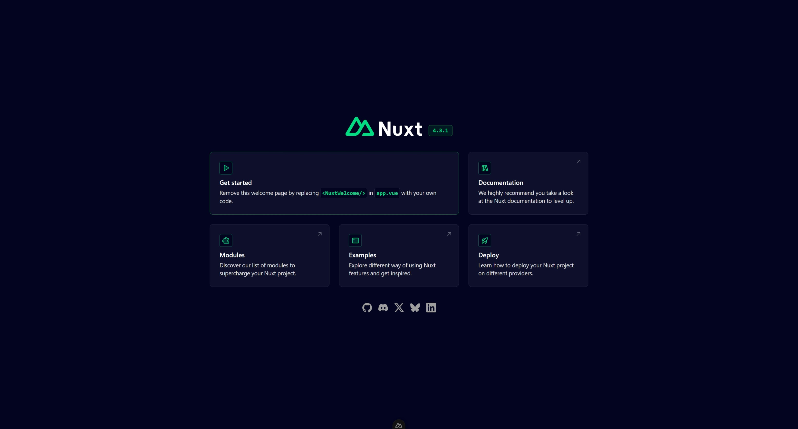

# Nuxt Project Template



A clean Nuxt starter designed for quick project kickoff with a simple, readable structure.

## What's Included

- Nuxt 4 app structure with `app/` entry.
- Global styles at [app/assets/css/main.css](app/assets/css/main.css).
- Static assets in [public/](public/).
- TypeScript support with config and lint setup for modern Nuxt projects.

## Pre-installed Libraries

Runtime dependencies:

- Nuxt
- Vue
- Vue Router
- Tailwind CSS
- Tailwind CSS Vite plugin

Dev tooling:

- ESLint
- Nuxt ESLint
- Prettier
- Prettier Tailwind CSS plugin
- eslint-plugin-perfectionist

## Requirements

- Node.js 18+ (recommended 20+)
- pnpm (recommended), npm, yarn, or bun

## Docker

This template includes Docker setup files:

- [Dockerfile](Dockerfile)
- [docker-compose.yml](docker-compose.yml)
- [.dockerignore](.dockerignore)

## Quick Start

Install dependencies:

```bash
pnpm install
```

Start dev server:

```bash
pnpm dev
```

The app runs at `http://localhost:3000`.

## Common Scripts

```bash
# dev server
pnpm dev

# production build
pnpm build

# preview production build
pnpm preview
```

## Customize

- Update the global styles in [app/assets/css/main.css](app/assets/css/main.css).
- Replace the default UI in [app/app.vue](app/app.vue).
- Add static assets to [public/](public/).

## Learn More

- Nuxt docs: https://nuxt.com/docs/getting-started/introduction
- Deployment: https://nuxt.com/docs/getting-started/deployment
